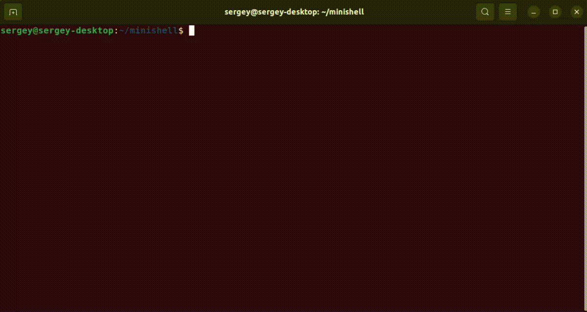

# Minishell

### Description
Minimalistic version of bourne-again shell. Command language interpreter that executes
commands read from the standard input or from a file.




### Supported features
features ```|``` ```<``` ```<<``` ```>``` ```>>```</br>builtin functions: ```cd ``` ```pwd``` ```exit <arg>``` ```env``` ```unset``` ```export``` ```echo -n``` ```$?```  ```$```

### Usage
    ./minishell
